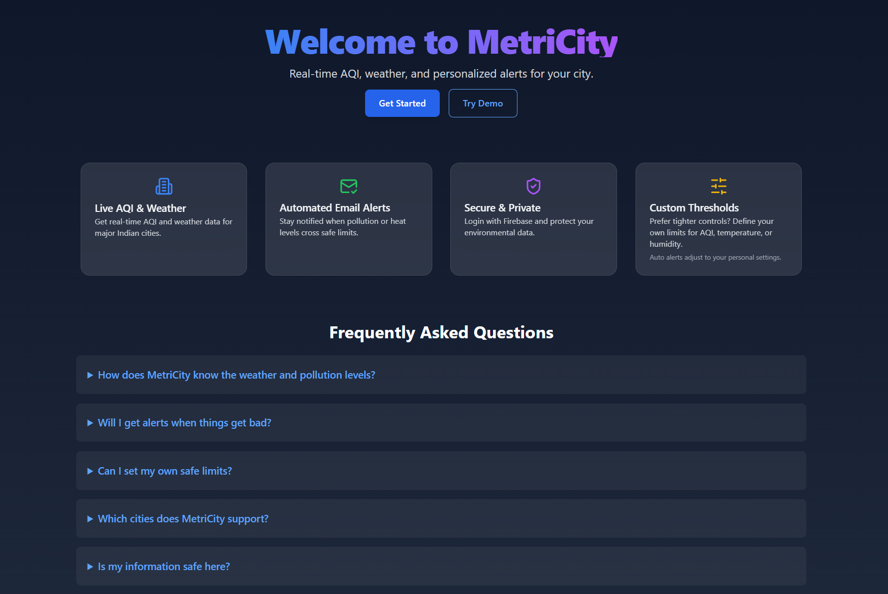

# MetriCity – Real-Time City Pollution & Weather Alerts 
Real-time environmental dashboard & auto-alerting for Indian cities. Get live AQI, weather stats, and email alerts based on custom thresholds.

[Live Demo →](https://metri-city.vercel.app)

MetriCity is a production-grade, full-stack web app that provides **real-time air quality and weather insights** for Indian cities, and triggers **automated, threshold-based email alerts**. It combines **React**, **Firebase Auth**, **AWS Lambda**, **DynamoDB**, and **SES** to deliver a scalable, secure, and user-centric experience. Ideal for demonstrating practical applications of modern cloud-native architecture.

---

## System Capabilities
- **Monitors** AQI and weather conditions in real time.
- **Stores** user preferences and thresholds (auto/manual).
- **Automatically triggers alerts** via AWS Lambda & SES.
- **Protects user data** using Firebase Authentication.
- **Presents data beautifully** in a responsive dashboard.

---

## Core Features

### Secure Auth (Firebase)
- Email/password sign-up and login.
- Real-time auth state detection.
- Protected routes for dashboard access.

### User Customization
- Select city from curated list.
- Choose between **Auto Mode** (age-based thresholds) or **Manual Mode** (user-defined AQI, temp, humidity limits).
- Preferences saved to `CityPulseUsers` table in DynamoDB.

### Dashboard
- Live display of:
  - Temperature (actual & feels-like)
  - Humidity
  - AQI (via WAQI)
  - Wind speed, pressure, visibility, cloud cover
  - Sunrise/sunset
- Embedded Google Map view
- Dark/light mode toggle

### Fully Automated Alerts
- AWS Lambda triggered hourly via EventBridge (cron).
- Checks current conditions against thresholds.
- Sends alert emails via Amazon SES.
- Logs outcomes in CloudWatch ("Alert sent" / "No alert needed").

---

## Architecture Overview

**Frontend**: React + Tailwind + Firebase Auth + Google Maps Embed  
**Backend**: Serverless Node.js (ESM) on AWS Lambda  
**Infra**: DynamoDB, SES, EventBridge Scheduler, API Gateway  
**APIs**: OpenWeatherMap, AQICN (WAQI), Maps Embed API 	

---

## Deployment

- Frontend hosted on [Vercel](https://vercel.com)
- Backend deployed in AWS Mumbai (ap-south-1)
- APIs exposed via AWS API Gateway:
  - `POST /RegisterUserHandler`
  - `POST /CheckUserRegistered`
  - `POST /trigger-alerts`
- Scheduler: Amazon EventBridge (hourly triggers)

---

## Security & Privacy
- Authenticated access via Firebase
- All thresholds and preferences scoped per user
- No sensitive data exposed on client

---

## Repo
> [Github Link](https://github.com/priyanshisaraf/MetriCity)
